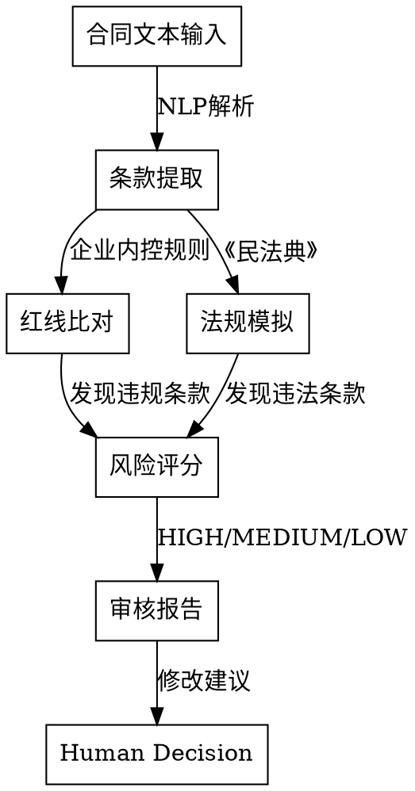
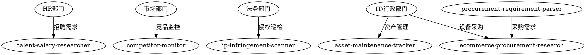

# SRM 智能体系统综合说明

## 系统概述

本系统包含 **10个智能体技能**，覆盖采购全生命周期（采购前→采购中→采购后）以及跨部门横向扩展场景。通过自然语言处理、工作流编排和数据抓取技术，实现企业职能部门的智能化升级。

---

## 技能总览

| # | 技能目录 | 职能 | 输入 | 输出 |
|---|----------|------|------|------|
| 1 | `ecommerce-procurement-research/` | **采购询价**（多平台比价） | keyword / URL | CSV + Markdown 价格报告 |
| 2 | `procurement-requirement-parser/` | **需求解析**（采购前） | 非结构化文本 | 结构化 BOM |
| 3 | `supplier-risk-assessor/` | **供应商风控**（采购中） | 供应商名称 / CSV | 风险评估报告 |
| 4 | `contract-manager/` | **合同管理与审核**（采购后） | 采购信息 / 合同文本 | 合同草稿 / 审核报告 |
| 5 | `invoice-matcher/` | **三单匹配**（采购后） | 采购单 + 收货单 + 发票 | 匹配报告 |
| 6 | `talent-salary-researcher/` | **人才招聘**（HR） | JD / 职位要求 | 薪酬对标报告 |
| 7 | `competitor-monitor/` | **竞品监测**（市场） | 竞品关键词 | 舆情分析周报 |
| 8 | `ip-infringement-scanner/` | **侵权巡检**（法务） | 品牌 / 商标信息 | 侵权证据报告 |
| 9 | `im-bot-gateway/` | **IM集成**（基础设施） | IM 消息 | 技能路由 + 响应 |
| 10 | `web-reader/` | **网页阅读**（基础设施） | URL | Markdown 内容 |

---

## 技能详解

### 1. procurement-requirement-parser（需求解析）

**职能：** 将非结构化文本（聊天记录、邮件）转为结构化 BOM

**输入示例：**
```
我们需要给研发部买10台机械键盘，手感好一点的，预算5000以内
```

**输出结构：**
```json
{
  "items": [{
    "item_name": "机械键盘",
    "category": "IT设备",
    "quantity": 10,
    "unit": "台",
    "budget_max": 500,
    "requirements": ["手感好"],
    "priority": "quality"
  }],
  "department": "研发部",
  "urgency": "normal"
}
```

---

### 2. ecommerce-procurement-research（采购询价）

**职能：** 多平台（淘宝/京东/拼多多/1688）商品数据抓取与比价

**输入：** keyword（如"机械键盘"）

**输出：** CSV + Markdown 价格对比报告

**输出字段：**
```csv
rank,product_name,price,rating,sales_volume,platform,source_url
1,iPhone 15 Case,29.99,4.8,10000,taobao,https://...
```

---

### 3. supplier-risk-assessor（供应商风控）

**职能：** 查询天眼查/企查查等数据源，评估供应商风险

**国内适配数据源：**
- 中国执行信息公开网（失信被执行人）
- 裁判文书网（涉诉记录）
- 国家企业信用信息公示系统（经营异常）
- 市场监督管理总局（行政处罚）
- 税务部门公开信息（税务异常）

**风险维度与权重：**
| 维度 | 权重 | 数据来源 |
|------|------|----------|
| 失信被执行人 | 25% | 中国执行信息公开网 |
| 涉诉记录 | 20% | 裁判文书网 |
| 经营异常 | 20% | 国家企业信用信息公示系统 |
| 行政处罚 | 15% | 市场监督管理总局 |
| 税务异常 | 10% | 税务部门公开信息 |
| 注册资本实缴 | 10% | 企业年报 |

**输出结构：**
```json
{
  "supplier_name": "xxx科技有限公司",
  "unified_credit_code": "91440300MA5xxxxx",
  "risk_score": 45,
  "risk_level": "MEDIUM",
  "dimensions": {
    "dishonest_count": 0,
    "litigation_count": 2,
    "abnormal_count": 0,
    "penalty_count": 1,
    "tax_abnormal": false,
    "registered_capital": "100万(实缴50万)",
    "established_date": "2015-03-20",
    "business_status": "存续"
  },
  "recommendation": "建议谨慎合作"
}
```

**风险等级：**
- `LOW` (0-30): 供应商可推荐
- `MEDIUM` (31-60): 建议谨慎合作，需担保
- `HIGH` (61-100): 供应商不推荐

---

### 4. contract-manager（合同管理与审核）

**职能：** 生成采购合同 + 审核合同条款

本技能包含两个核心子功能：

#### 4.1 合同自动生成

根据采购信息填充标准模板，自动生成完整合同文本：

```
采购信息 → 合同各条款自动填充 → Markdown/DOCX
```

**模板字段：**
| 字段 | 说明 |
|------|------|
| `party_a_name` | 甲方（采购方）名称 |
| `party_b_name` | 乙方（供应商）名称 |
| `contract_no` | 合同编号 |
| `item_list` | 采购物品清单 |
| `total_amount` | 合同总金额 |
| `payment_terms` | 付款条件 |
| `delivery_date` | 交付日期 |
| `warranty_period` | 质保期 |

#### 4.2 合同条款审核（Contract Audit）

对企业提供的合同进行红队分析，识别风险点：

```
合同文本 → 条款提取 → 风险点识别 → 修改建议
```

**国内法规适配：**

| 《民法典》条款 | 要点 |
|---------------|------|
| 第465条 | 合同约束力 |
| 第496条 | 格式条款定义 |
| 第497条 | 格式条款无效情形 |
| 第506条 | 合同无效情形 |
| **第585条** | **违约金上限（不超过实际损失30%）** |
| 第590条 | 不可抗力条款 |
| 第591条 | 减损义务 |

**企业红线条款检查：**

| 风险类型 | 红线标准 | 建议修改 |
|----------|----------|----------|
| 违约金比例 | >合同金额20% | 下调至15%以内 |
| 管辖法院 | 对方所在地 | 建议改为"原告所在地" |
| 预付款比例 | 预付>50% | 建议月结或验收后付款 |
| 保密条款 | 无上限赔偿 | 建议限定金额 |
| 知识产权 | 无限制转让 | 建议限定用途 |

**审核报告输出：**
```json
{
  "overall_risk": "MEDIUM",
  "risk_score": 55,
  "clauses": [
    {
      "clause": "违约金为合同金额的30%",
      "issue": "违约金比例过高",
      "legal_ref": "《民法典》第585条：不超过实际损失的30%",
      "suggestion": "建议调整为20%或以下",
      "severity": "HIGH"
    },
    {
      "clause": "管辖法院为乙方所在地",
      "issue": "管辖法院对甲方不利",
      "legal_ref": "《民事诉讼法》第34条",
      "suggestion": "建议改为原告所在地或合同签订地",
      "severity": "MEDIUM"
    }
  ],
  "summary": "合同存在2个高风险条款，建议修改后再签署"
}
```

---

### 5. invoice-matcher（三单匹配）

**职能：** 核对采购单、收货单、发票一致性

**三单匹配原理：**
```
采购单 (PO)     ←→  采购询价确认的价格、数量
    ↓
收货单 (GR)    ←→  物流签收单/入库单
    ↓
发票 (Invoice)  ←→  增值税发票金额、税率
```

**匹配规则：**
- 金额匹配：发票含税金额 ≈ 采购单金额 (±0.01允许误差)
- 数量匹配：发票数量 ≤ 采购数量
- 税率匹配：与采购要求一致
- 供应商匹配：发票销售方 ≈ 采购供应商

**匹配状态：**
| 状态 | 处理方式 |
|------|----------|
| MATCHED | 自动通过，发起付款流程 |
| PARTIAL_MATCH | 标记异常，人工审核 |
| MISMATCH | 拒绝付款，联系供应商 |

**国内发票支持：**
| 发票类型 | 税率 | 可抵扣 |
|----------|------|--------|
| 增值税专用发票 | 6%/9%/13% | 是 |
| 增值税普通发票 | 6%/9%/13% | 否 |
| 电子发票 | 同上 | 同上 |

---

### 6. talent-salary-researcher（人才招聘）

**职能：** JD解析 + 候选人筛选 + 薪酬对标

**支持平台：** Boss直聘、猎聘、智联招聘、前程无忧、拉勾、脉脉

**薪酬数据来源：**
| 来源 | 可靠性 | 说明 |
|------|--------|------|
| 薪智 | 高 | 行业薪酬报告（付费） |
| 看准网 | 中 | 员工自报薪资 |
| 智联薪酬报告 | 高 | 年度报告 |
| 猎聘薪酬报告 | 高 | 行业报告 |

**薪酬对标算法：**
```python
# P25/P50/P75分位计算
level_factors = {
    "entry": 0.7,      # 校招
    "junior": 0.85,    # 1-3年
    "mid": 1.0,        # 3-5年
    "senior": 1.2,     # 5-8年
    "expert": 1.5       # 8年+
}
```

---

### 7. competitor-monitor（竞品监测）

**职能：** 监控竞品在小红书/抖音/微博的产品宣发、价格、舆情

**支持平台：**

| 平台 | 数据类型 | 抓取难度 |
|------|----------|----------|
| 小红书 | 种草笔记、商品链接、用户评论 | 中 |
| 抖音 | 短视频、直播、商品橱窗 | 高（需官方API） |
| 微博 | 品牌官微、话题、热搜 | 低 |
| 微信 | 公众号文章 | 中 |
| 什么值得买 | 优惠信息、商品历史价 | 低 |

**监控维度：**
| 维度 | 指标 | 数据来源 |
|------|------|----------|
| 产品 | 新品发布、产品迭代 | 小红书、微博 |
| 价格 | 促销信息、到手价 | 什么值得买、京东 |
| 口碑 | 笔记数、点赞、评论 | 小红书、微博 |
| 营销 | 话题热度、投放力度 | 微博热搜、抖音挑战赛 |
| 舆情 | 正负面评价、投诉 | 全平台 |

---

### 8. ip-infringement-scanner（侵权巡检）

**职能：** 电商平台商标/外观侵权检测

**侵权类型：**
| 类型 | 说明 | 证据要求 |
|------|------|----------|
| 商标侵权 | 未经授权使用注册商标 | 商标证 + 侵权截图 |
| 专利侵权 | 外观/实用新型/发明专利 | 专利证书 + 侵权证据 |
| 著作权侵权 | 图片、文案抄袭 | 著作权登记证 + 侵权内容 |
| 假货 | 假冒品牌 | 鉴定报告 + 购买鉴定 |

**支持平台投诉入口：**
| 平台 | 投诉入口 |
|------|----------|
| 淘宝/天猫 | 阿里知识产权保护平台 (ipp.alibaba.com) |
| 京东 | 京东维权平台 |
| 拼多多 | 拼多多知产保护 |
| 1688 | 1688举报中心 |

**侵权判断标准：**
| 侵权类型 | 判断标准 |
|----------|----------|
| 商标相似 | 商标文字/图形相似度>80% |
| 价格异常 | 售价<正品价的30% |
| 销量异常 | 短时间内销量激增 |
| 图文抄袭 | 商品图片相似度>70% |

---

### 9. im-bot-gateway（IM集成）

**职能：** 企业 IM 消息路由 + 技能调度

**支持平台：** 飞书、企业微信、钉钉

**意图路由表：**

| 命令示例 | 触发技能 | 说明 |
|----------|----------|------|
| 询价 "iPhone 15手机壳" | `ecommerce-procurement-research` | 多平台比价 |
| 供应商风控 "xxx公司" | `supplier-risk-assessor` | 风险评估 |
| 合同审核 | `contract-manager` | 条款审核 |
| 合同生成 | `contract-manager` | 模板填充 |
| 发票报销 | `invoice-matcher` | 三单匹配 |
| 人才招聘 "Python开发" | `talent-salary-researcher` | 薪酬对标 |
| 竞品监控 | `competitor-monitor` | 舆情分析 |
| 侵权巡检 | `ip-infringement-scanner` | 侵权检测 |
| 资产维保 | `asset-maintenance-tracker` | 设备管理 |
| 帮助 | `im-bot-gateway` | 技能说明 |

---

### 10. web-reader（网页阅读）

**职能：** 使用 Jina Reader API 将任意 URL 转换为 LLM 友好的 Markdown 格式

**API 端点：**
```
https://r.jina.ai/{目标URL}
```

**基础用法：**

| 调用方式 | 示例 |
|----------|------|
| URL 前缀 | `https://r.jina.ai/https://example.com` |
| API 调用 | `curl https://r.jina.ai/https://example.com` |

**Python 调用：**

```python
from web_reader import read_url, read_url_json

# Markdown 格式返回
content = read_url("https://tianchi.aliyun.com/forum/post/1001440")

# JSON 格式返回（包含标题、时间戳）
page = read_url_json("https://example.com")
print(page.title, page.content)
```

**返回格式：**

| 格式 | 说明 |
|------|------|
| Markdown（默认） | 干净的文本，自动去除广告、导航栏 |
| JSON | 包含 url、title、content、timestamp 字段 |

**限流说明：**

| 方案 | RPM | 说明 |
|------|-----|------|
| 无 API Key | 20 RPM | 适合个人使用 |
| 免费 API Key | 500 RPM | 注册获取 |
| 付费 API Key | 5000 RPM | 高频使用 |

**Jina Reader vs Playwright 对比：**

| 特性 | Jina Reader | Playwright |
|------|-------------|------------|
| 速度 | 快 | 慢 |
| JavaScript 执行 | 不支持 | 支持 |
| 登录页面 | 不支持 | 支持 |
| 内容质量 | 好（去除噪声） | 原始 HTML |
| 适用场景 | 内容阅读、RAG | 动态网页、交互 |

**常见中文内容源支持：**

- 知乎文章
- 天池论坛帖子
- 微信公众号文章
- 阿里云文档
- 各种技术博客和新闻网站

---

## 智能体协作流程

### 采购全生命周期流程

```dot
digraph procurement_lifecycle {
    rankdir=LR;
    node [shape=box];
    
    "需求录入" -> "procurement-requirement-parser" [label="非结构化文本"];
    "procurement-requirement-parser" -> "ecommerce-procurement-research" [label="keyword + BOM"];
    "ecommerce-procurement-research" -> "supplier-risk-assessor" [label="CSV(含供应商)"];
    "supplier-risk-assessor" -> "contract-manager" [label="选定供应商"];
    "contract-manager" -> "Human Approval" [label="合同签署"];
    "Human Approval" -> "invoice-matcher" [label="收货+发票"];
    "invoice-matcher" -> "Human Approval" [label="付款审批"];
}
```



### 合同审核详细流程



### 跨部门协作流程



---

## 智能体调用关系

### 上游下游关系

| 智能体 | 下游调用 | 被上游调用 |
|--------|----------|------------|
| `procurement-requirement-parser` | `ecommerce-procurement-research` | - |
| `ecommerce-procurement-research` | `supplier-risk-assessor` | `procurement-requirement-parser`, `asset-maintenance-tracker` |
| `supplier-risk-assessor` | `contract-manager` | `ecommerce-procurement-research` |
| `contract-manager` | - | `supplier-risk-assessor` |
| `invoice-matcher` | - | `contract-manager` (间接) |
| `im-bot-gateway` | 所有技能 | - |

### 数据流向

```
非结构化文本
    ↓
procurement-requirement-parser → BOM (结构化需求)
    ↓
ecommerce-procurement-research → CSV (比价结果)
    ↓
supplier-risk-assessor → 风险报告 (LOW/MEDIUM/HIGH)
    ↓
contract-manager → 合同草稿 / 审核报告
    ↓
Human Approval → 签署合同
    ↓
invoice-matcher → 三单匹配报告
    ↓
Human Approval → 付款
```

---

## 独立使用场景

以下技能可独立使用，不依赖其他技能：

| 技能 | 独立场景 |
|------|----------|
| `talent-salary-researcher` | 招聘季、薪酬调整 |
| `competitor-monitor` | 竞品分析周报 |
| `ip-infringement-scanner` | 品牌保护、假货打击 |
| `asset-maintenance-tracker` | IT资产盘点、维保到期提醒 |
| `im-bot-gateway` | IM机器人对话入口 |
| `web-reader` | 网页内容提取、RAG数据准备 |

---

## 人类在环（Human-in-the-loop）

以下环节需要人工审批，不得自动执行：

| 环节 | 审批人 | 原因 |
|------|--------|------|
| 合同签署 | 法务/管理层 | 法律效力 |
| 大额付款 | 财务总监 | 资金安全 |
| 供应商准入 | 采购负责人 | 风险管控 |
| 设备报废 | IT负责人 | 资产安全 |
| 合同审核通过 | 法务 | 合规保障 |

---

## 技术栈

| 类别 | 技术选型 |
|------|----------|
| **数据抓取** | Playwright（网页自动化）、Jina Reader API（轻量级网页读取） |
| **数据处理** | Pandas（数据分析） |
| **OCR识别** | 百度OCR / 腾讯OCR / 阿里云OCR |
| **LLM调用** | OpenAI API / 国内模型（GLM、Qwen等） |
| **API框架** | FastAPI |
| **企业集成** | 飞书SDK、企业微信SDK、钉钉SDK |
| **国内数据源** | 天眼查API、企查查API、裁判文书网 |
| **发票查验** | 国家税务总局发票查验平台 |
| **网页内容提取** | Jina Reader API（r.jina.ai） |

---

## 实施建议

### 阶段一：快速见效（1-2周）
1. 部署 `im-bot-gateway` 到群聊
2. 业务部门可直接 @机器人 询价
3. 验证意图路由准确性

### 阶段二：采购闭环（1个月）
4. 打通 `procurement-requirement-parser` → `ecommerce-procurement-research`
5. 增加 `supplier-risk-assessor` 风控环节
6. 对接企业微信/飞书审批流

### 阶段三：全流程自动化（2-3个月）
7. 接入 `contract-manager` 合同生成与审核
8. 接入 `invoice-matcher` 三单匹配
9. 配置人类在环审批节点
10. 部署横向扩展技能（HR、法务、市场）

---

## 质量保障

每个技能都包含：

- **输入输出规范**：标准化的数据结构
- **国内适配**：符合中国法律法规和商业惯例
- **错误处理**：降级策略和错误提示
- **质量检查表**：交付前的自检清单
- **常见错误**：帮助用户避免常见问题
