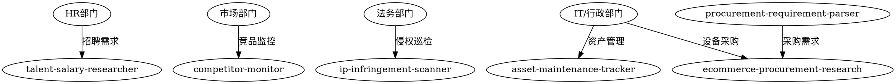

# SRM 智能体系统技能总览

## 系统架构

本系统包含 **9个智能体技能**，覆盖采购全生命周期（采购前→采购中→采购后）以及跨部门横向扩展场景。

## 技能清单

| # | 技能目录 | 职能 | 输入 | 输出 |
|---|----------|------|------|------|
| 1 | `ecommerce-procurement-research/` | **采购询价**（多平台比价） | keyword / URL | CSV + Markdown 价格报告 |
| 2 | `procurement-requirement-parser/` | **需求解析**（采购前） | 非结构化文本 | 结构化 BOM |
| 3 | `supplier-risk-assessor/` | **供应商风控**（采购中） | 供应商名称 / CSV | 风险评估报告 |
| 4 | `contract-manager/` | **合同管理**（采购后） | 采购信息 / 合同文本 | 合同草稿 / 审核报告 |
| 5 | `invoice-matcher/` | **三单匹配**（采购后） | 采购单 + 收货单 + 发票 | 匹配报告 |
| 6 | `talent-salary-researcher/` | **人才招聘**（HR） | JD / 职位要求 | 薪酬对标报告 |
| 7 | `competitor-monitor/` | **竞品监测**（市场） | 竞品关键词 | 舆情分析周报 |
| 8 | `ip-infringement-scanner/` | **侵权巡检**（法务） | 品牌 / 商标信息 | 侵权证据报告 |
| 9 | `im-bot-gateway/` | **IM集成**（基础设施） | IM 消息 | 技能路由 + 响应 |

---

## 技能详解

### 1. procurement-requirement-parser（需求解析）

**职能：** 将非结构化文本（聊天记录、邮件）转为结构化 BOM

**输入示例：**
```
我们需要给研发部买10台机械键盘，手感好一点的，预算5000以内
```

**输出结构：**
```json
{
  "items": [{
    "item_name": "机械键盘",
    "category": "IT设备",
    "quantity": 10,
    "unit": "台",
    "budget_max": 500,
    "requirements": ["手感好"],
    "priority": "quality"
  }],
  "department": "研发部",
  "urgency": "normal"
}
```

---

### 2. ecommerce-procurement-research（采购询价）

**职能：** 多平台（淘宝/京东/拼多多）商品数据抓取与比价

**输入：** keyword（如"机械键盘"）

**输出：** CSV + Markdown 价格对比报告

**输出字段：**
```csv
rank,product_name,price,rating,sales_volume,platform,source_url
1,iPhone 15 Case,29.99,4.8,10000,taobao,https://...
```

---

### 3. supplier-risk-assessor（供应商风控）

**职能：** 查询天眼查/企查查等数据源，评估供应商风险

**国内适配数据源：**
- 中国执行信息公开网（失信被执行人）
- 裁判文书网（涉诉记录）
- 国家企业信用信息公示系统（经营异常）
- 市场监督管理总局（行政处罚）

**输出结构：**
```json
{
  "supplier_name": "xxx科技有限公司",
  "risk_score": 45,
  "risk_level": "MEDIUM",
  "dimensions": {
    "dishonest_count": 0,
    "litigation_count": 2,
    "abnormal_count": 0,
    "penalty_count": 1
  },
  "recommendation": "建议谨慎合作"
}
```

---

### 4. contract-manager（合同管理）

**职能：** 生成采购合同 + 审核合同条款

**国内法规适配：**
- 《民法典》第585条：违约金不超过实际损失30%
- 《民事诉讼法》第34条：管辖法院约定
- 增值税发票条款

**红线条款检查：**
| 风险类型 | 红线标准 |
|----------|----------|
| 违约金比例 | ≤20% |
| 管辖法院 | 甲方有利 |
| 预付款比例 | ≤50% |

---

### 5. invoice-matcher（三单匹配）

**职能：** 核对采购单、收货单、发票一致性

**匹配规则：**
- 金额匹配：发票含税金额 ≈ 采购单金额 (±0.01)
- 数量匹配：发票数量 ≤ 采购数量
- 税率匹配：与采购要求一致

**状态：** MATCHED / PARTIAL_MATCH / MISMATCH

---

### 6. talent-salary-researcher（人才招聘）

**职能：** JD解析 + 候选人筛选 + 薪酬对标

**支持平台：** Boss直聘、猎聘、智联招聘、前程无忧、拉勾、脉脉

**薪酬数据来源：**
- 薪智（行业薪酬报告）
- 看准网（员工自报）
- 智联/猎聘薪酬报告

---

### 7. competitor-monitor（竞品监测）

**职能：** 监控竞品在小红书/抖音/微博的产品宣发、价格、舆情

**监控维度：**
| 维度 | 指标 |
|------|------|
| 产品 | 新品发布 |
| 价格 | 促销信息 |
| 口碑 | 笔记数、点赞、评论 |
| 舆情 | 正负面评价 |

---

### 8. ip-infringement-scanner（侵权巡检）

**职能：** 电商平台商标/外观侵权检测

**侵权类型：**
- 商标侵权
- 专利侵权（外观/实用新型/发明）
- 著作权侵权
- 假货

**证据留存：** Playwright 截图 + 店铺/商品链接

---

### 9. im-bot-gateway（IM集成）

**职能：** 企业 IM 消息路由 + 技能调度

**支持平台：**
- 飞书
- 企业微信
- 钉钉

**意图路由：**
| 命令 | 触发技能 |
|------|----------|
| 询价 [商品] | ecommerce-procurement-research |
| 供应商风控 [名称] | supplier-risk-assessor |
| 合同审核 | contract-manager |
| 发票报销 | invoice-matcher |
| 人才招聘 [岗位] | talent-salary-researcher |
| 竞品监控 | competitor-monitor |
| 侵权巡检 | ip-infringement-scanner |
| 资产维保 | asset-maintenance-tracker |

---

## 智能体协作流程

### 采购全生命周期流程

```dot
digraph procurement_lifecycle {
    rankdir=LR;
    node [shape=box];
    
    "需求录入" -> "procurement-requirement-parser" [label="非结构化文本"];
    "procurement-requirement-parser" -> "ecommerce-procurement-research" [label="keyword + BOM"];
    "ecommerce-procurement-research" -> "supplier-risk-assessor" [label="CSV(含供应商)"];
    "supplier-risk-assessor" -> "contract-manager" [label="选定供应商"];
    "contract-manager" -> "Human Approval" [label="合同签署"];
    "Human Approval" -> "invoice-matcher" [label="收货+发票"];
    "invoice-matcher" -> "Human Approval" [label="付款审批"];
}
```



### 跨部门协作流程



---

## 智能体调用关系

### 上游下游关系

| 智能体 | 下游调用 | 被上游调用 |
|--------|----------|------------|
| `procurement-requirement-parser` | `ecommerce-procurement-research` | - |
| `ecommerce-procurement-research` | `supplier-risk-assessor` | `procurement-requirement-parser`, `asset-maintenance-tracker` |
| `supplier-risk-assessor` | - | `ecommerce-procurement-research` |
| `contract-manager` | - | `supplier-risk-assessor` |
| `invoice-matcher` | - | `contract-manager` (间接) |
| `im-bot-gateway` | 所有技能 | - |

### 数据流向

```
文本输入
    ↓
procurement-requirement-parser → BOM (结构化需求)
    ↓
ecommerce-procurement-research → CSV (比价结果)
    ↓
supplier-risk-assessor → 风险报告
    ↓
contract-manager → 合同
    ↓
invoice-matcher → 付款申请
```

---

## 独立使用场景

以下技能可独立使用，不依赖其他技能：

| 技能 | 独立场景 |
|------|----------|
| `talent-salary-researcher` | 招聘季、薪酬调整 |
| `competitor-monitor` | 竞品分析周报 |
| `ip-infringement-scanner` | 品牌保护、假货打击 |
| `asset-maintenance-tracker` | IT资产盘点、维保到期提醒 |
| `im-bot-gateway` | IM机器人对话入口 |

---

## 人类在环（Human-in-the-loop）

以下环节需要人工审批，不得自动执行：

| 环节 | 审批人 | 原因 |
|------|--------|------|
| 合同签署 | 法务/管理层 | 法律效力 |
| 大额付款 | 财务总监 | 资金安全 |
| 供应商准入 | 采购负责人 | 风险管控 |
| 设备报废 | IT负责人 | 资产安全 |

---

## 技术栈

- **数据抓取：** Playwright（网页自动化）
- **数据处理：** Pandas（数据分析）
- **OCR识别：** 百度OCR/腾讯OCR/阿里云OCR
- **LLM调用：** OpenAI API / 国内模型（GLM、Qwen等）
- **API框架：** FastAPI
- **企业集成：** 飞书SDK、企业微信SDK、钉钉SDK
- **国内数据源：** 天眼查API、企查查API、裁判文书网

---

## 下一步建议

### 阶段一：快速见效
1. 部署 `im-bot-gateway` 到群聊
2. 业务部门可直接 @机器人 询价

### 阶段二：采购闭环
3. 打通 `procurement-requirement-parser` → `ecommerce-procurement-research`
4. 增加 `supplier-risk-assessor` 风控环节

### 阶段三：全流程自动化
5. 接入合同审核 + 三单匹配
6. 增加人类在环审批节点
