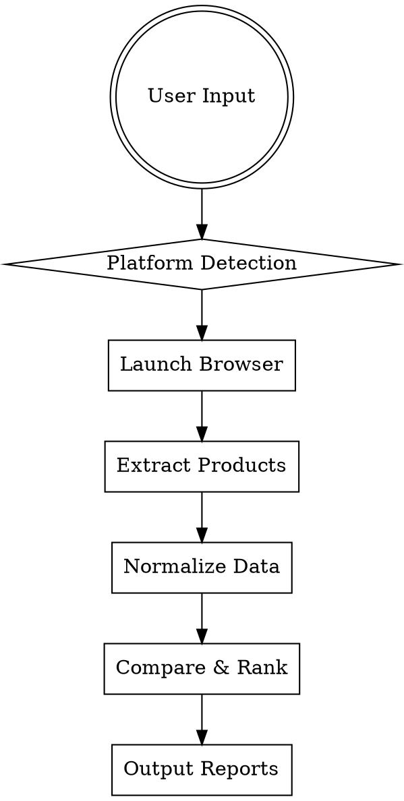

# E-commerce Procurement Research

## Overview

Automated product research and price comparison across e-commerce platforms using Playwright browser automation. Extracts product data (price, rating, sales volume) and outputs comparison reports in CSV and Markdown formats.

## When to Use

- **Procurement research**: Finding best prices for bulk orders
- **Supplier discovery**: Comparing multiple sellers across platforms
- **Price monitoring**: Tracking product prices over time
- **Quote generation**: Creating formatted comparison documents for procurement decisions

## Quick Reference

| Task | Command |
|------|---------|
| Search by keyword | `python -m scraper --keyword "机械键盘" --platforms taobao,jd` |
| Search by URL | `python -m scraper --url "https://..." --platforms all` |
| Output formats | `--output csv,md` (default both) |
| Max results per platform | `--limit 20` |

## Core Workflow



## Supported Platforms

| Platform | Domain | Notes |
|----------|--------|-------|
| 淘宝 | taobao.com | Requires login for full data |
| 天猫 | tmall.com | Higher quality sellers |
| 京东 | jd.com | Strong家电/3C品类 |
| 拼多多 | pdd.com | Price-focused |
| 1688 | 1688.com | 批发/源头工厂 |
| 亚马逊 | amazon.com | 国际参考价格 |
| 通用 | any URL | Fallback scraper |

## Input Formats

### Keyword Search
```bash
python -m scraper --keyword "iPhone 15手机壳" --platforms taobao,jd,pdd
```

### URL Direct
```bash
python -m scraper --url "https://search.jd.com/search?keyword=机械键盘" --platforms jd
```

### Batch File
```bash
python -m scraper --input products.txt --platforms all
```

## Output Format

### CSV Output (`product_comparison_YYYYMMDD_HHMMSS.csv`)
```csv
rank,product_name,price,rating,sales_volume,platform,source_url
1,iPhone 15 silicone case,29.99,4.8,10000+,taobao,https://...
2,Spigen iPhone 15 case,24.99,4.7,5000+,amazon,https://...
```

### Markdown Output (`product_comparison_YYYYMMDD_HHMMSS.md`)
```markdown
# Product Comparison Report
**Generated:** 2026-03-21 15:30:00  
**Search Term:** iPhone 15 case

| Rank | Product | Price | Rating | Sales | Platform |
|------|---------|-------|--------|-------|----------|
| 1 | iPhone 15 Silicone Case | ¥29.99 | ⭐4.8 | 10k+ | taobao |
| 2 | Spigen iPhone 15 Case | $24.99 | ⭐4.7 | 5k+ | amazon |
```

## Data Normalization

All extracted data is normalized for comparison:

| Field | Format | Example |
|-------|--------|---------|
| price | Float (CNY) | 29.99 |
| rating | Float (0-5) | 4.7 |
| sales_volume | Integer | 10000 |

Currency conversion applied for non-CNY sources.

## Error Handling

| Error | Handling |
|-------|----------|
| Site blocked | Retry with delay, fallback to another platform |
| No products found | Return empty results with warning |
| Network timeout | Retry up to 3 times with exponential backoff |
| Login required | Skip or prompt for credentials |

## Common Mistakes

| Mistake | Fix |
|---------|-----|
| Not checking robots.txt | Verify allowed before scraping |
| Ignoring rate limits | Add delays between requests |
| Skipping data validation | Always normalize price to float |
| Hardcoding selectors | Use adaptive selectors per platform |

## Implementation

See `scraper/` directory for platform-specific implementations:
- `base.py` - Abstract base class
- `taobao_scraper.py` - 淘宝/天猫
- `jd_scraper.py` - 京东
- `pdd_scraper.py` - 拼多多
- `generic_scraper.py` - 通用网页

## Dependencies

```bash
pip install playwright pandas
playwright install chromium
```

## Usage Example

```python
from scraper import ProductResearcher

researcher = ProductResearcher()
results = researcher.search(
    keyword="机械键盘",
    platforms=["taobao", "jd", "pdd"],
    limit=20
)
researcher.generate_report(results, formats=["csv", "md"])
```
